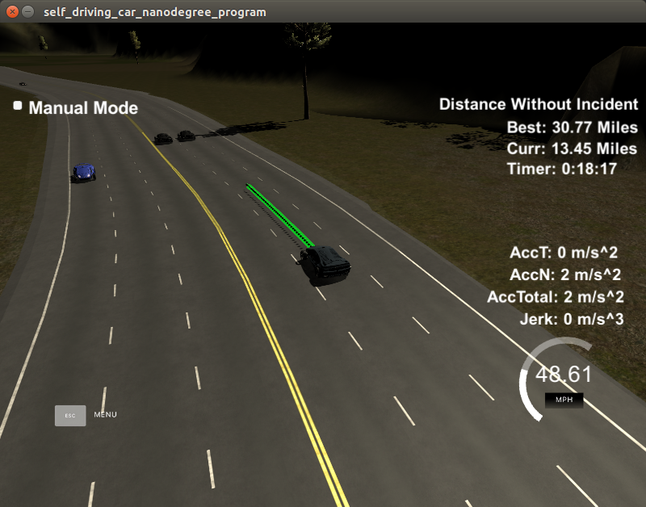

# PP_Cman

## Submission for Term3 Project 1: Path Planning

__Objective:__ 
Implement a path planner that safely navigates a simulator car around a virtual highway cycle of 4.32 miles. There are other cars on the road driving between +-10 MPH of the 50 MPH speed limit. The car shall run as close as possible to the speed limit, passing slower traffic when possible. The car must avoid collisions and must drive inside the lane marks, except when changing lanes. The car must not exceed acceleration over 10 m/s^2 and jerk greater than 50 m/s^3.

> This project integrates the following parts:

1. **Sensor Fusion** - Gather and process sensor data about the vehicle's state and the surrounding objects (for this project: vehicles)
2. **Prediction** - Estimate where the surrounding objects will appear over a finite time horizon (0.02ms)
3. **Behavior Planning** - Decide the vehicle's driving intent and target operating conditions
4. **Trajectory Generation** - Make a path trajectory that achieves the behavior target safely
5. **Control** - Actuate the vehicle to follow the planned path trajectory

Passing the project requires a successful simulator track run and documentation, pls see project rubics: https://review.udacity.com/#!/rubrics/1020/view. Boilerplate code provided by Udacity under https://github.com/udacity/CarND-Path-Planning-Project.

> Improvements made to:

* src/[main.cpp](./src/main.cpp)

## Implementation

> Beside existing program code following steps have been implemented:

1. Set the initial state and read the sensor data
2. Detect objects (eg. vehicles) in same lane and predict their position/behavior
3. Evaluate potential maneuvers and simulate with safety thresholds
4. Actuate safe maneuver
5. Initialize path tangent using previous path waypoints
6. Construct path interpolating predicted waypoints with spline (incl. lane changes) 
7. Space & transform path points and send to simulator
8. Tune threshold and distance parameter of the controller to drive safely

### Implementation Details

#### Initial State
The system assumes the car starts in the center lane, standstill. It gradually accelerates.

#### Planning the Path
Logic follows as outlined in the project walkthrough [video](https://youtu.be/7sI3VHFPP0w?t=1520). We essentially use 50 waypoints tangent with the end of the previous path (or, at start the car's current position). Then 3 predicted waypoints every 30m are added. Fitting a spline function helps to calculate intermediate points of a path vector to travel smooth and in desired target speed.

#### Avoiding Collisions

> The system avoids collisions with objects in the same lane that are detected by the sensors. The feature consists of:

1. Looping throug each sensor record filtering for objects a) in the same lane and b) too close using a threshold parameter `THRES_FRONT`. 
2. A maneuver `go_left` is simulated. The system predicts the violation of distance margin `DIST_FRONT` and `DIST_REAR` to other objects froming a potential lane gap in the target lane, also checking for staying in the left most lane. 
3. If safe, the maneuver `go_left` is actuated, otherwise `go_right` is simulated respectively. If both simulations fail the safety procedure, the controller reduces the velocity adapting to the object speed and until actual distance > `THRES_FRONT` or lane change `is_safe` again. 
4. If the lane is free, the car accelerates to a speed limit set to 48 MPH.

These constants determine the safety procedure for lane change maneuvers. They represent a balance build while testing more than 200 miles in the simulator, therein 45.53 miles without incident. Main factors in order of importance are: avoid collisions, avoid incidents, drive fast, drive smooth. 

#### Potential Improvements (see TODO: in code)
1. Controller: Left turns a favored, but optimizing a cost function for entire sensor data could set the best choice. Brake and throttle behavior while adapting to object speed should be smoothed.   
2. PREDICTION: When a lane change maneuver is executed while another object changes into the same target lane safety is at risk. Almost all collisions observed are caused by (sudden) lateral movements into the target lane. The prediction mechanism should be considering eg. lateral distance margin.

## Compilation and Simulation

> build instructions: run shell-commands from the project directory

1. Clone this repo.
2. Make directory in project: `mkdir build && cd build`
3. Compile: `cmake .. && make`
4. Run it: `./path_planning`.
5. Run and start the MPC simulator (resolution: 600x800, Mode: fantastic)

## Data Structures 

> See Udacity https://github.com/udacity/CarND-Path-Planning-Project/blob/master/README.md for info about

* Car's localization Data (No Noise)
* Previous path data given to the Planner
* Previous path's end s and d values
* Sensor Fusion Data, a list of all other car's attributes on the same side of the road. (No Noise)

## Environment
* Simulator: The project involves Term 3 Simulator which can be downloaded here: https://github.com/udacity/self-driving-car-sim/releases. A server package uWebSocketIO is setting up a connection from the C++ program to the simulator, which acts as the host.
* OS Setup: Ubuntu 16.4, for details pls see [here](https://classroom.udacity.com/nanodegrees/nd013/parts/40f38239-66b6-46ec-ae68-03afd8a601c8/modules/0949fca6-b379-42af-a919-ee50aa304e6a/lessons/f758c44c-5e40-4e01-93b5-1a82aa4e044f/concepts/23d376c7-0195-4276-bdf0-e02f1f3c665d)
* Eigen package: Eigen is already part of the repo, pls see: http://eigen.tuxfamily.org/index.php?title=Main_Page

## Screenshot Archive

 

 

 

 

 

 

